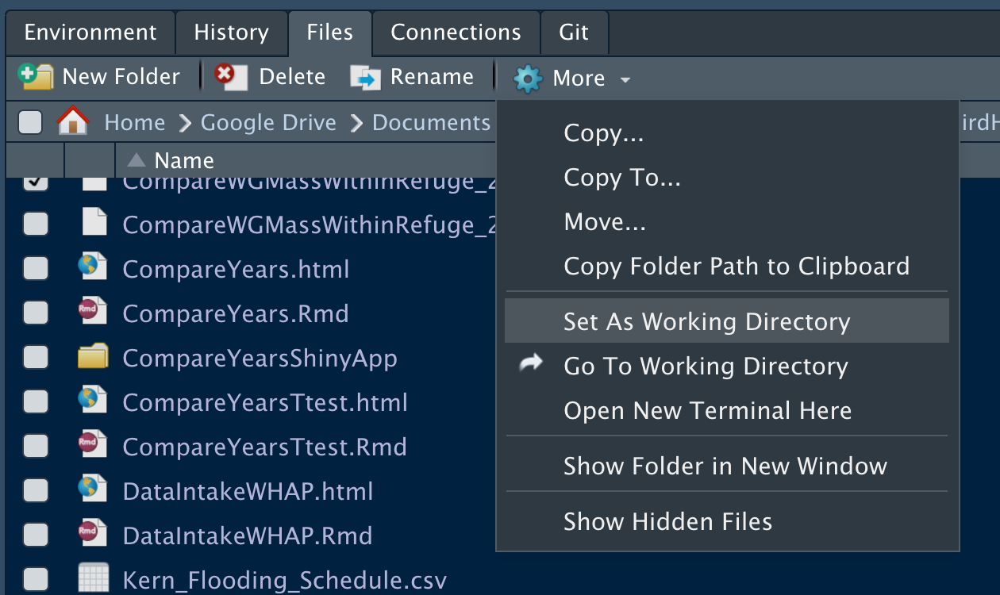
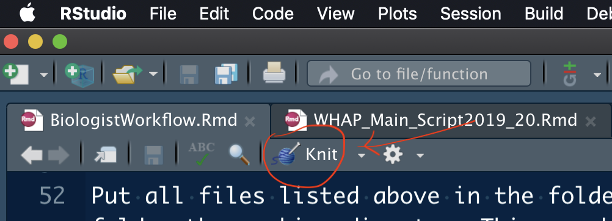

```{r setup, include=FALSE}

knitr::opts_chunk$set(echo = TRUE)

```

## THIS SCRIPT IS IN PROGRESS. IT ASSUMES THAT DATA ARE IN THE ORIGINAL STRUCTURE. DATA AND ANALYSES ARE RESTRICTED TO WATERGRASS AND SWAMP TIMOTHY

A much better workflow will be created by designing it holistically as opposed to piecemeal, which is the current state. A holistic approach requires definition of a workflow and functions necessary in the software prior to creating code.

### Introduction

These instructions assume that RStudio and all necessary packages are installed or that the user can install whatever is not already in place.

Follow these instructions to obtain all results for WHAP analysis for a year or a set of predetermined years.

### Data files and scripts necessary

The following data files are necessary for each year that will be included in the analysis and reports (yyyy represent the year):

- MU_yyyy.txt
- VP_yyyy.txt
- CP_yyyy.txt
- QDT_yyyy.txt
- st_all_noO.rds
- wgdat.rds
- WHAP_Viability.csv

Data files are used by the following scripts needed for the analyses:

- WHAP_Main_Script_yyyy.Rmd
- CompareYears.Rmd
- CompareYearsTtest.Rmd
- PrintTablesByRefuge.Rmd
- WHAP_viability_graphs_tables.Rmd

WHAP_Main_Script_yyyy.Rmd reads in all data files required, except for WHAP_Viability.csv, and computes estimated seedhead production per unit area for each subunit measured in year yyyy. At this point the user has to manually make or get a different WHAP_Main_Script_yyyy.Rmd for each year that will be involved in estimates and comparisons.

### Workflow steps

#### Collect files and scripts in dedicated directory

Make a folder in a known location in your computer and call it WHAP_Analysis_ddmmmyyyy_XXX where ddmmmyyyy is the "official" date for the analysis (for example 01Jan2022) and XXX are the capitalized initials of the user.

Put all files listed above in the folder. Open RStudio and make WHAP_Analysis_ddmmmyyyy_XXX the folder the working directory This can be done, for example, by clicking on the Files tab in RStudio, navigating to the folder and then Clicking More ... Set Working Directory as shown in the figure below.



#### Perform main analysis and obtain estimates for units and year

Open **WHAP_Main_Script_yyyy.Rmd** for each year and click Knit at the top of the file tab, just under its name. See figure below. If knitting stops before producing an html file visible in the Viewer tab, record the error message shown in the R Markdown. If you can, fix the error and knit the file. If you cannot fix the error, send the error message to and consult with someone who can fix it.



Inspect the html files produced to find tables and figures that you can use for the report. At this time we have not defined specifications for the format of pieces of the output to be used in other software. You can copy graphs and tables from html reports by selection and right-clicking, etc. Then you can paste into Excel or Word tables, text, etc. 

#### Make tables and graphs by refuge

Open **WHAP_viability_graphs_tables.Rmd** and knit it. See the resulting html file for figures and other useful output.

#### Compare treatments

This scrip is the least general because it depends on data columns that are not in the protocol. At this point we have one comparison "hardwired" and flexible comparisons that can be achieved using completely unstructured options in a Shiny app.


#### Compare years

Open **CompareYears.Rmd** and knit it. At present, this script only compares 2019 and 2020, because file names are "hardwired." A more flexible script can be used once we have a known method or convention for naming files.

### 
