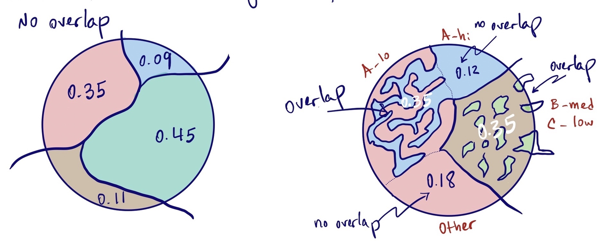
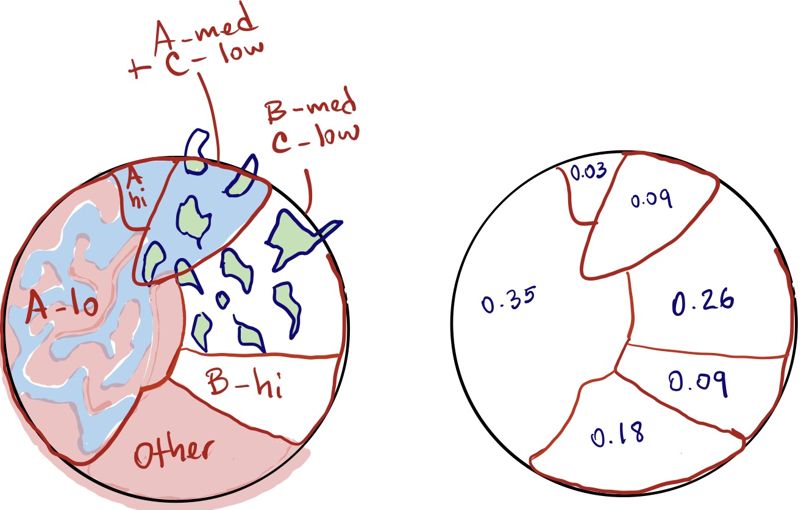

```{r setup, include=FALSE}

knitr::opts_chunk$set(echo = TRUE)
library(tidyverse)

```

## Current method

The current method and calculations assume that the species-stratum combinations are exclusive, i.e., they do not "overlap" on the same area. Any subarea in the area observed belongs to a single species-stratum combination. Classes for each subarea observed are all combinations of species and strata (Number of species x number of strata) plus 1 for all other types of cover. The sum of all proportions of are covered by some class is 1.

Presumably, the strata of density (low, medium, high) for each species accounted for cases where bare ground, litter or other "no-food" species covered the part of the area. Consider species A, B, C and Other for other. Suppose that a circle plot is assessed to have 0.5 of the area covered by A-low. Presumably, this low density is caused by a combination of:

1. fewer than 100% soil covered with A,
2. few seedheads per unit area covered by A.

In case 1, the area not covered by A is assumed to have Other, whose density of seedheads is irrelevant under this scheme.

### Current method correction

In the current method the sum of proportion of area covered by each of the no. spp x no. strata + 1 categories has to equal 1. This allows observers to estimate proportions for each class without having to worry about making sure that they all add up to 1.0 and it prevents the issue of under- or overestimated "leftover" classes. The observer just needs to make sure that all estimates are commensurate with the proportions in the area observed. For example, A-low seems to cover 0.25 and A-high seems to cover 0.40 and B-low seems to cover twice as much as A-low or 0.5, while Other is about 0.1. The method provides a means to "correct" such observations by dividing each proportion by their sum.

This method avoids the following problem: upon getting to estimate B-low the observer realizes that if A-low is 0.25 and A-high is 0.4, B-low can't be 0.5, particularly considering that there is still some area covered by Other. At that point the observer either underestimates B-low and Other to achieve a sum of 1.0 or starts the process again, reducing the original estimates. By the fact that under this method all categories have to add up to 1 and with the assumption that any over- or underestimation of individual classes is constant as a proportion, this method allows the observer not to worry about the total sum of proportions estimated. Based on my subjective experience, I think this method is very valuable because in reality it is based on comparisons of areas that are visible simultaneously instead of estimation of absolute proportions. I think it is easier to see that one area is twice as much as another than to see that one area is 15% of the total. We can test this with areas on the screen with a few people if necessary.



## Method for overlapping species

The method has to be modified to account for species that overlap. By "overlap" we mean that different food species appear together inside convex area units used as measurement or observation "grain" regardless of how the observation units are arranged in space. See figure below for clarification. We can use the ubiquitous 0.35 cm x 0.35 cm quadrat as our grain.

### Method 1: Estimate species as if they were separate.

This method requires that the observer to mentally "move" overlapping species into separate areas and correct their densities. There is not unique way to move species in the imagination. For example, one could "move" all species into a small part of the total area resulting in small areas with high density of each species and a large area without food species. This method must used in a way that total seed head mass and total area are conserved. An example shows how easy it is to violate the conservation of mass.

Total area is 10 ha. There is 5% under high st, 5% under other cover. The remaining 90% is a mixture of high st, low wg and low sw. For simplicity, assume the following stratum yields: 

|  spp_stratum  |  yield kg/ha   | area ha|  contribution  |
|--------------:|---------------:|-------:|---------------:|
|  other cover  |     0          |   0.5  |      0         |
|  low wg       |    500         |   9    |   4500         |
|  low sw       |    300         |   9    |   2700         |
|  high st      |   3000         |   0.5  |   1500         |
|  high st      |   3000         |   9    |  27000         |


True Total = 4500 + 2700 + 1500 + 27000 = 35700 kg

This calculation is based on the assessment that all of the 90% with overlapping species had each of the spp_stratum combinations mentioned. See figure below for a graphical representation.

```{r sims1}
# Based on
# http://santiago.begueria.es/2010/10/generating-spatially-correlated-random-fields-with-r/
# unconditional simulations on a 100 x 100 grid using gstat
library(gstat)
library(sp)
 
xyfield <- expand.grid( x = 1:200, y = 1:200)

# define the gstat object (spatial model)

g_model <- function(.range = 5) {
  gstat(formula = z ~ 1,
        locations = ~ x + y,
        dummy = T,
        beta = 0,
        model = vgm(psill = 1,
                    model = "Exp",
                    range = .range),
        nmax = 20)
}


sim_plot <- function(.xdim = 200, .ydim = 200, .model = g_model, ...) {
  
  xyfield <- expand.grid( x = 1:.xdim, y = 1:.ydim)
  
  z1 <- predict(.model(...),
                newdata = xyfield,
                nsim = 1) %>%
    mutate(across(starts_with("sim"), ~ cut(.x, breaks = quantile(.x, 0:10/10))))
  
  gridded(z1) = ~ x + y
  
  spplot(z1, col.regions = reg.cols)
  
}

sim_plot(.xdim = 300, .ydim = 300, .range = 5)


# make simulations based on the stat object
# z1 is more random
z1 <- predict(g_model(.range = 3),
             newdata = xyfield,
             nsim = 1) %>%
  mutate(across(starts_with("sim"), ~ cut(.x, breaks = quantile(.x, 0:10/10))))

gridded(z1) = ~ x + y


reg.cols <- c("chartreuse4",
              "chartreuse4",
              "gold2",
              "gold2",
              "brown3",
              "brown3",
              "skyblue",
              "skyblue",
              "brown3",
              "skyblue")

spplot(z1, col.regions = reg.cols)

reg.cols <- c("chartreuse4",
              "chartreuse4",
              "gold2",
              "gold2",
              "brown3",
              "brown3",
              "brown3",
              "skyblue",
              "skyblue",
              "skyblue")

spplot(z1, col.regions = reg.cols)

# z2 is more clustered
z2 <- predict(g_model(.range = 20),
             newdata = xyfield,
             nsim = 1) %>%
  mutate(across(starts_with("sim"), ~ factor(round(abs(.x), 0))))

gridded(z2) = ~ x + y

reg.cols <- c("chartreuse4",
              "skyblue",
              "gold2",
              "gold2",
              "chartreuse4",
              "brown3",
              "skyblue",
              "blue",
              "black",
              "brown3")

spplot(z2, col.regions = reg.cols)

table(z2$sim1)


```


### Method 2: Estimate each species separately

This option ignores the overlap and simply estimates each species-stratum combination independently. As a consequence, this method cannot use the correction based on the sum of all estimates being 1. When there is overlap the sum of all categories can theoretically range from 1 to $4^n$ where n is the number of different food species considered.

Advantage: The maximum number of classes possible is no. spp x no. strata + 1. For watergrass, smartweed and swamp timothy the number of classes is 13.

Drawback: no correction possible.

Using this method, the circle plot in the right would result in the following data:

| Stratum  | Proportion | Stratum mass/area |
|---------:|-----------:|------------------:|
| A-high   |       0.12 |   $M_{A-high}$    |
| A-low    |       0.35 |   $M_{A-low}$     |
| B-medium |       0.35 |   $M_{B-medium}$  |
| C-low    |       0.35 |   $M_{C-low}$     |
| Other    |       0.18 |   $0$             |
| Total    | meaningless|                   |

Total seedhead mass per unit area in circle plot:
$$ 0.12 \times M_{A-high} + 0.35 \times M_{A-low} + 0.35 \times M_{B-medium} + 0.35 \times M_{C-low}  $$


### Method 3: Estimate each of the species combinations

This option accounts for overlap by estimating the proportion of each combination of species-stratum present in each subarea. Total area is split into a series of non-overlapping classes, where each class is defined by all the species-stratum combinations. This method allows the correction based on the sum of all proportions being equal to 1.

Advantage: the total of all proportions estimated must be 1; thus, the proportional correction can be applied as in the current or original method.

Drawbacks: the number of classes can theoretically be very large ($4^n$ or 64 for three species) and it might be hard to identify the different classes in the field. 

The setup to collect data has to be modified because each row of representing each subarea can potentially be associated with multiple rows of species and strata. When species do not overlap, there is a one-to-one relationship between subareas in VP or CP, species and stratum. With overlap, each subarea row will be potentially associated with multiple species-stratum rows. A DBM system approach dictates that a new table be created between the VP or CP table and the observation table. The figure below represents a suggestion for the solution.


The actual number of categories can be much smaller than the theoretical maximum. For example, assuming that the species are watergrass, swamp timothy and smartweed, and that swamp timothy does not overlap with either of the other species, the total number of classes is 3 watergrass + 3 smartweed + 3 swamp timothy + 9 smartweed and swamp timothy + 1 Other = 19.

Moreover, the combinations may be further restricted if we consider that when more than one species are interspersed in an area, it may be unusual or unfeasible for all species to be in high density categories.


Using this method, the circle plot in the right would result in the following data:

| Stratum          | Proportion | Stratum mass/area             |
|-----------------:|-----------:|------------------------------:|
| A-high           |       0.12 |   $M_{A-high}$                |
| A-low            |       0.35 |   $M_{A-low}$                 |
| B-medium & C-low |       0.35 |   $M_{B-medium} + M_{C-low}$  |
| Other            |       0.18 |   $0$                         |
| Total            |       1.00 |                               |

Total seedhead mass per unit area in circle plot:
$$ 0.12 \times M_{A-high} + 0.35 \times M_{A-low} + 0.35 \times M_{B-medium} + 0.35 \times M_{C-low}  $$

The following example underlines the differences in the methods. The same figure as above has been modified simply by moving the area with C-low out of the area with B-medium and into A-high. The result should be that the total area with C-low remains the same but now mixed into A and B, whereas A-high declines by the same amount that B-high increases.

Although the example shows that density of A declines from high to medium when an interspersed area of C is superimposed, this does not necesarily have to always be the case. It is possible that some areas have two species with both in high density. This depends on how the high-medium-low strata are defined in that particular season and refuge.

*Stratum of each species has to be assessed independently of whatever else is in the same subarea.*




The new set of proportions of area are:

| Stratum          | Proportion | Stratum mass/area             |
|-----------------:|-----------:|------------------------------:|
| A-high           |       0.03 |   $M_{A-high}$                |
| A-medium & C-low |       0.09 |   $M_{A-medium} + M_{C-low}$  |
| A-low            |       0.35 |   $M_{A-low}$                 |
| B-high           |       0.09 |   $M_{B-high}$                |
| B-medium & C-low |       0.26 |   $M_{B-medium} + M_{C-low}$  |
| Other            |       0.18 |   $0$                         |
| Total            |       1.00 |                               |


This method can be organized as follows:

1. look at the area (VP visible area or CP) and divide it into a series of non-overlapping subareas that are much more similar within than between subareas;
2. estimate the proportion of total area represented by each subarea;
3. determine the combination of species-strata present in each subarea.

The new procedure will require a modification of the data structures and the survey process, which will probably require rewriting the instructions to use the survey tool (app).